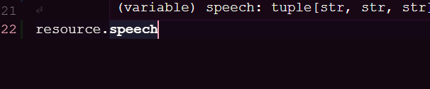
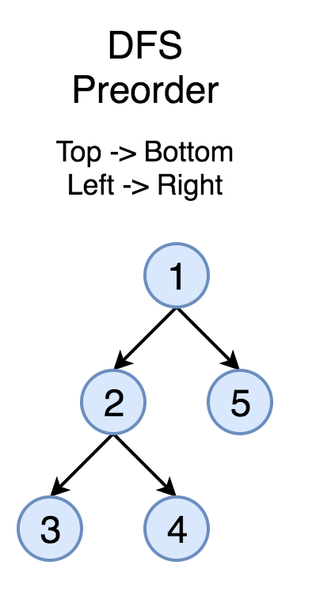

# Typesafe resource management in Python

This package creates a definition file by traversing the resource folder

## Showcase

```
# Your text files
resources/
    main.txt
    speech_0.txt
    speech_1.txt
    speech_2.txt
```

```py
# main.py
from apathy import *

resource_manger = ResourceManager(
    # The resource folder
    "resources",
    DefinitionFile(
        # The default import statement for types
        "from defaults import *",
        # The destination file to write to
        "resources/definition.py"
        ),
    # Middlewares
    [group_by(r"(.+)_(\d+)")],
    # Loaders
    [text]
)

# The file below does not exist yet
from definition import root

resource: root = resource_manager.root # type: ignore
```

```py
# defaults.py
# No need to import anything since type str is already imported
# Example
from some_code import YourClass
```

### Generates

```py
# 6769e4e13141958b8f2f7b5e6958fea7
# Automatically generated by ResourceManager at: 2023-01-15 20:25:47.409194
# DO NOT EDIT THIS FILE MANUALLY. 
# If you want to regenerate this file, change the integrity hash in the first line to something else

# Default import statement:
from defaults import *
# Main content:
from typing import NamedTuple

root = NamedTuple("root", [
  ("speech", tuple[
    str,
    str,
    str,
  ],),
  ("main", str),
])
```

### And provides you with type compilation



# Documentation

## Middlewares

Middlewares are functions that have the ability to modify the tree structure itself as well as change the value of the nodes

They are applied in the order they are passed to the ResourceManager, with each middleware doing a full DFS preorder traversal of the tree

```py
for middleware in middlewares:
    # The @middleware decorator will initiate the dfs preorder traversal
    tree = middleware(self, "<root>", tree)
```


This also means that the middleware will be applied to the leaf of the trees that it has returned. This is the most desirable behavior for applying middlewares

```py
@middleware
def strip_numbers_in_string(r: ResourceManager, location: str, tree: EntryTree) -> Optional[EntryTree]:
    """Removes all number property from tree"""
    if isinstance(tree, EntryDict):
        new_tree = EntryDict()
        for key in list(tree.keys()):
            n = re.sub(r"\d+", "", key)
            new_tree[n] = tree[key]
        # If a new dict or list is returned, it will replace the old one
        # Be sure to return a new EntryTree
        return new_tree
    # Returning None indicates that the tree should not be changed
    # You can also modify tree in place and it will be reflected
    return None
```

## Loaders

Loaders are simpler middlewares. They are functions that only take the leaf node and transform it into a useful value.

Most leaf nodes are `Path` objects

The resource manager will attempt to apply each loader to the leaf node in the order they are passed to the ResourceManager. Returning `None` indicates that the loader does not know how to handle the leaf node and will pass it to the next loader

```py
for loader in self.loaders:
    if (r := loader(self, obj)) is not None:
        return r
```

If you want multiple loaders to be applied the same leaf node see the example code at the bottom

```py
# Basic loaders
@loader
def return_suffix(r: ResourceManager, path: Path) -> str:
    return path.suffix

@loader
@extension("mp3")
def pygame_load(r: ResourceManager, path: Path) -> pygame.mixer.Sound:
    return pygame.mixer.Sound(path)

fallback_image = pygame.image.load("fallback.png")

@loader
@extension(r"png|jpg|jpeg")
@fallback(fallback_image) # If the loading raises an Exception
def pygame_image_load(r: ResourceManager, path: Path) -> pygame.Surface:
    return pygame.image.load(path)

# Advanced loaders

# Loader that accepts certain object nodes
# Requires a compatible middleware to generate such leaves
@loader(Script)
def execute(r: ResourceManager, s: Script) -> object:
    return s.execute()

# Two transformations
@loader
def str_node(r: ResourceManager, path: Path) -> str:
    return path.read_text()

@loader(str)
def str_to_int(r: ResourceManager, s: str) -> int:
    if s.isnumeric():
        return int(s)

@loader
def combined(r: ResourceManager, path: Path) -> Union[str, int]:
    res = path
    for l in [str_node, str_to_int]:
        if (t := l(r, res)) is not None:
            res = t
    return res
```